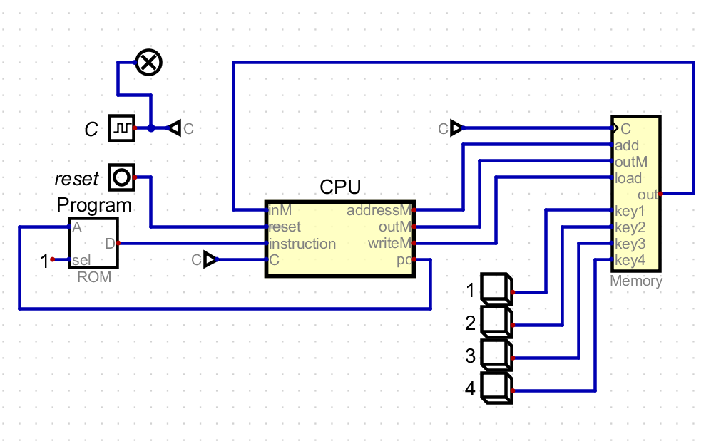
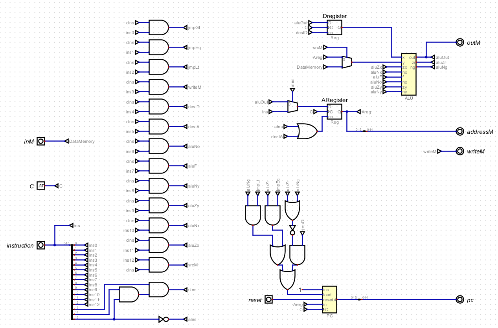
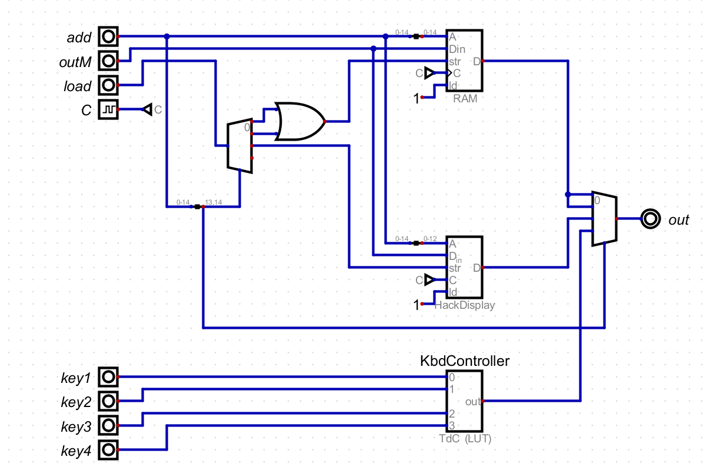

# Como interactuan cada uno de los componenetes del computador simulado?

Durante se la actividad se descargo un simulador de una repositorio de github para ver el funcionamiento de un computador y sus componenetes.  
[Descargar Simulador](https://github.com/henryandr/Digital_custom)

Al abrir el simulador nos encontraremos con el circuito del computador el cual vemos a simple vista el CPU y la Memoria del mismo.  
El funcionamiento consiste en que la señal de pc sale con una dirrecion la cual entra a la memoria ROM y una vez alli procesar esa dirreccion para dar al computador una instruccion.  
A continuacion veremos el circuito tanto del CPU como de la Memoria

## Circuito del CPU

Como podemos ver el CPU esta compuesto en su mayoria compuesto por compuertas logicas.

## Circuito de la Memoria

.